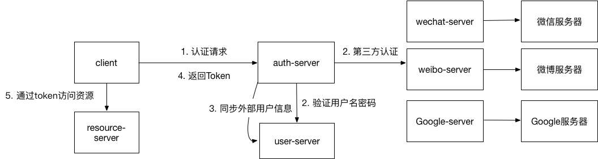

# 认证服务
通过auth-server作为认证，可以对接微信，微博，google的多种第三方认证。同时也可以对接user-server通过用户名密码进行认证。  
1. 客户端调用auth-server进行认证
2. auth-server根据认证方式不同调用第三方服务或者user-server。
3. 对于第三方认证（微信等）成功后，需要将用户信息存入user-server并创建用户，以便后续权限控制。
4. 通过jwt生成token，token包含userid，过期时间等信息，返回客户端。
5. 客户端通过token访问resource-server

