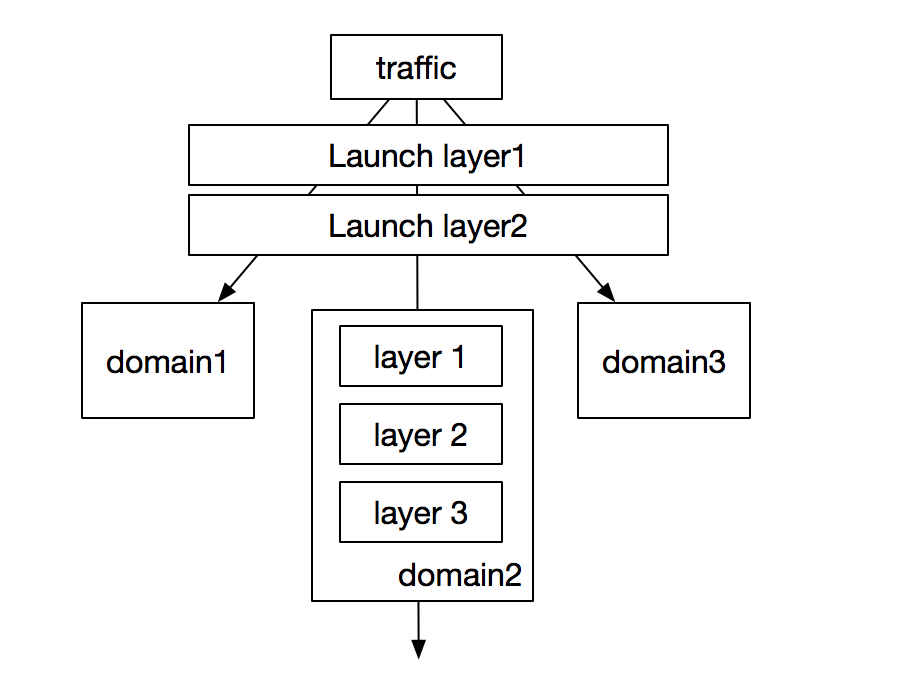

# ABTest experiment platform

## Paper
According to google paper: Overlapping Experiment Infrastructure  
https://storage.googleapis.com/pub-tools-public-publication-data/pdf/36500.pdf

## Traffic Partition  
  
traffic can be partitioned by the following way
- **launch layer**: launch layer is a special layer which can receive all the traffic
- **vertically**: traffic is divided into only one domain 
- **horizontally**: traffic is shared by different layers inside one domain and each layer is independent. at most one experiment can be hit in each layer
- **Nested layer** : layer can be nested inside the domain


## Model  
  - **layer experiment**
  ```
    private String name;        // name of experiment
    private String owner;       // owner of experiment
    private String description; // description of experiment
    private String region       // region of experiment
    private String layer;       // layer of experiment
    private int percentage;     // percentage of experiemnt in the layer
    private int type;           // cookie,url,random,etc.
    private String channel      // pc,web,ios,etc.
    private String callback;    // callback parameters given back to the caller
    private int domainId
  ```
  - **domain**
  ```
    private int id
    private String name
    private int percentage
  ```


## Request distribution  
  - **experiment type**
    1. cookie
    2. url
    3. random  

  - **request distribution**  
  if we split overall traffic into 100 and if f(cookie) % 100 = m is less than domain percentage, then the request hits domain experiment, otherwise the request hits layer experiments.  
  non-overlapping experiment can also be considered as a special type of overlapping layer experiments, e.g, layer=non-overlapping  
  
  - **hash function**  
  f(cookie,layer L) % 100 = m if m falls into the scope of experiment A in layer L, then experiment A is hit.

## Disjoint of experiment
To make sure experiments in different layer do not affect each other, experiments in each layer are disjoint of each other  
```
layer A : a:20%  ,  b:20%  , c:60%  
layer B : aa:10% ,  bb:10% , cc:80%  
```
the percentage of the requests hitting the experiment a in layer A is 20% and these requests should hit the experiments in the layer B evenly, which means requests hit a and aa should be 2% and requests hit a and bb should be 2% and requests hit a and cc should 16%


## Reference
- https://yq.aliyun.com/articles/5837
- https://www.jianshu.com/p/de8d9f0b14f4
- https://storage.googleapis.com/pub-tools-public-publication-data/pdf/36500.pdf