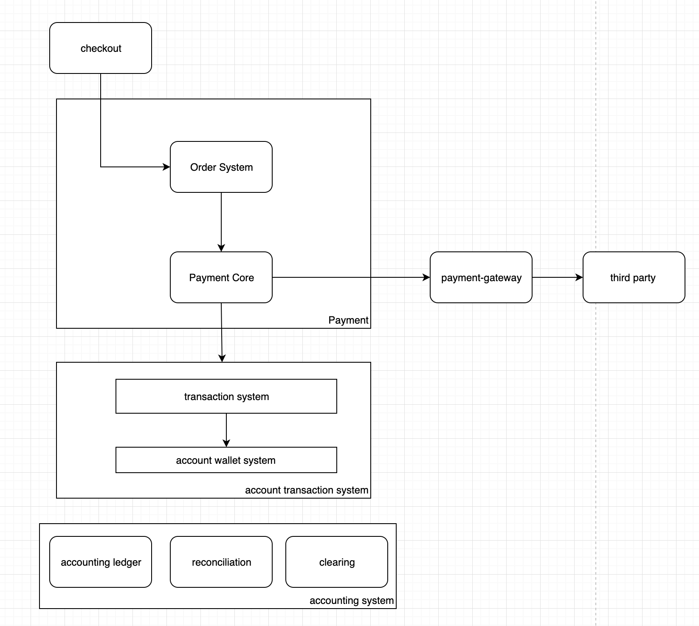

## Payment system
## Model

### User
- customer
    - legal entity
- user
    - login credential
- account
    - account wallet, balance change log
    - transactions
    - one user can have many accounts

### Payment 
- Order System: Order Business
- Payment Core: payment business
- checkout: UI 
- payment gateway: gateway of third party payment method
- accounting system: accounting, reconcilication, clearing

### Order System
- Order System: 
    - order(1) -> sub order(*): one order can be splitted into multiple sub orders
    - sub order(1) -> payment order(1)
        - OrderID
        - product
        - customer
        - shop
        - payment_method(wechat,alipay,visa,coupon)

### Payment Core
- Payment order state machine management: Payment order(1) -> Payment order items(*)
    - payment method
    - channel information
    - settlement information
    - status
    - Payment ID
    - Order 
- Payment tool management: balance, card, coupon, red-envelop, etc.
- Payment journal management. execute, retry, undo. Transaction management.
- Interact with external system: payment gateway(wechat,alipay,bank,etc), coupon system, etc.

### Account Transaction system(Single entry ledger)
- Transactions that contributed to the account balance
    - transaction_type
    - amount
    - currency
    - status
- Account management
    - account type
    - balance
    - reserved_balance
    - available_balance
    - status
    - currency

### Accounting Ledger
- Double entry ledger

### Reconciliation
- Reconciliation between internal payment system with external payment system(alipay,wechat,bank,etc).

## Tech design
### idempotency
- idempotency-key: unique key generated by client, expiration time: 24 hours.
- if the subsequent requests with the same `idempotency-key` return the same result and HTTP CODE = 409(Conflict) Or client can query the  result with the `idempotency-key`.
- procedure:
    - check idempotency-key existency. if exist: return the result saved and HTTP CODE: 409.
    - execute the pre-idempotent operation
    - execute the idempotent operation and save the result with the idempotency-key inside one transaction.
- Distributed transaction idempotency:
    -  downstream services need provide idempotent interface.

### Retry
- Error Design
    - Retryable error
        - Network Timeout
        - Rate Limiting
        - Service Unavailable
    - Unretryable error
        - Business Error(No Auth, No Money, Etc.)
- Retry: only when service return Unretryable error to notify client do not retry, otherwise client always need retry.
- Exponential Backoff: avoid overwhelm the downstream system.
- Downstream system ensure idempotency.

## Reference
- https://zhuanlan.zhihu.com/p/34142945
- http://www.woshipm.com/pd/585521.html