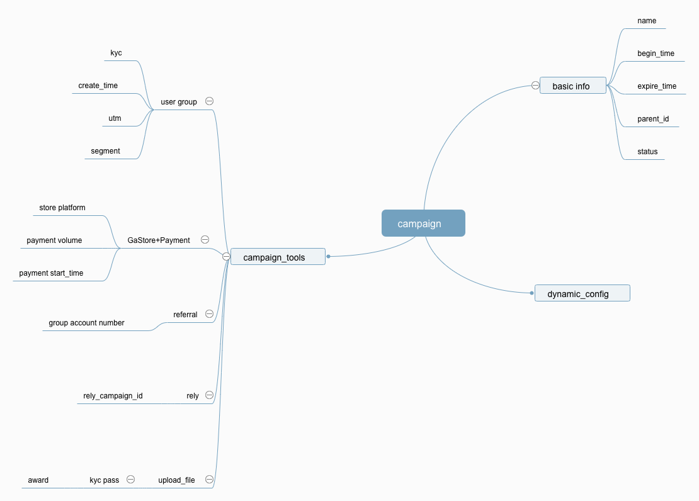

- Campaign = single campaign | complex campaign
- Single compaign = referral | store | payment | rely | upload file
- Complex campaign : contain multiple campaigns. When all campaigns success, the complex campaign successes.
- Parent campaign: attend campaign only when finish parent campaign
- Rely campaign_id: one condition of the campaign 

### 多区间活动
- 可以通过建立多个活动实现
- 绝对值  
    ```  
    [1-100]:    10
    [100-200]:  15
    [200-500]:  20
    [500-1000]: 30
    ```
- 递增值
    ```
    [1-100]:    10
    [100-200]:  5
    [200-500]:  5
    [500-1000]: 10
    ```
   