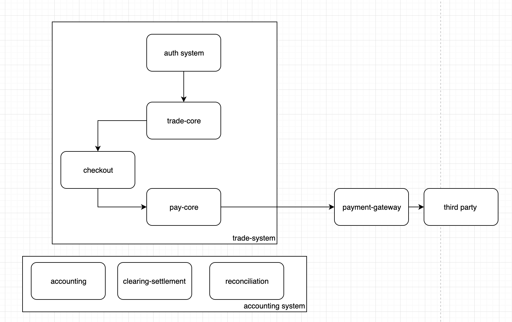

## Trade system
## Model

### User
- customer
    - legal
- user
    - login credential
- account
    - balance, balance history
    - transaction
    - settlement
    - one user can have many accounts

### Trade 
- Auth: tokenization
- Trade-core: trade business
- Pay-core: payment business
- checkout: UI 
- payment gateway: gateway of third party payment method
- accounting system: accounting, reconcilication, clearning and settlement

### Trade-core
- Trade Order management: 
    - order(1) -> sub order(*)
    - sub order(1) -> product item(*)
    - sub order(1) -> payment order

### Pay-core
- payOrder state machine management: order(1) -> order items(*)
- payment tool management: balance, card, coupon, red-envelop, etc.
- payment journal management. execute, retry, undo. Transaction management.
- interact with external system to debit or credit: wallet system, payment gateway, etc.

### idempotency
- idempotency-key: unique key generated by client, expiration time: 24 hours.
- if the subsequent requests with the same `idempotency-key` return the same result and HTTP CODE = 409(Conflict) Or client can query the  result with the `idempotency-key`.
- procedure:
    - check idempotency-key existency. if exist: return the result saved and HTTP CODE: 409.
    - execute the pre-idempotent operation
    - execute the idempotent operation and save the result with the idempotency-key inside one transaction.
- Distributed transaction idempotency:
    -  downstream services need provide idempotent interface.

### Retry
- Error Design
    - Retryable error
        - Network Timeout
        - Rate Limiting
        - Service Unavailable
    - Unretryable error
        - Business Error(No Auth, No Money, Etc.)
- Retry: only when service return Unretryable error to notify client do not retry, otherwise client always need retry.
- Exponential Backoff: avoid overwhelm the downstream system.
- Downstream system ensure idempotency.