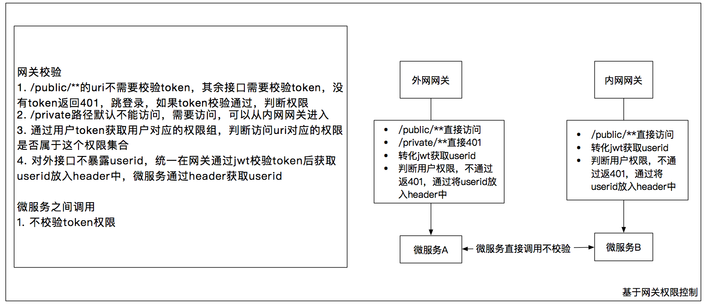

# 网关权限校验
## 目标  
通过网关统一管理权限控制，不用每个微服务控制

## 步骤
1. 用户登录，通过auth-server获取jwt token
2. /public/**的uri不需要校验token，其余接口需要校验token，没有token返回401，跳登录。如果token校验通过，判断权限
3. 对于同一个模块，既有外网接口又有内网接口的模块，如果需要控制某些接口外网不能访问，可以使用/private路径，/private路径默认不能访问，需要访问，可以从内网网关进入
4. 通过用户token获取用户对应的权限组，判断访问uri对应的权限是否属于这个权限集合，没有权限返回401
5. 对外接口不暴露userid，统一在网关通过jwt校验token后获取userid放入header中，微服务通过header获取userid
6. 需要控制跨域问题，对于options请求需要放行，同时网关需要处理跨域问题

微服务之间调用
1. 不校验token权限，避免耦合

