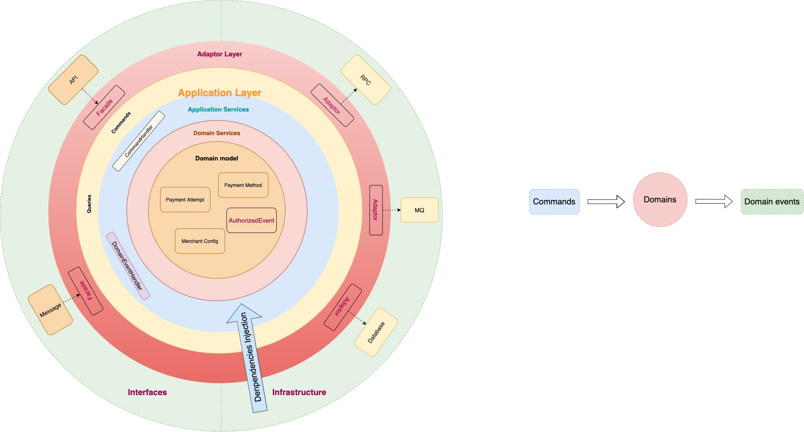
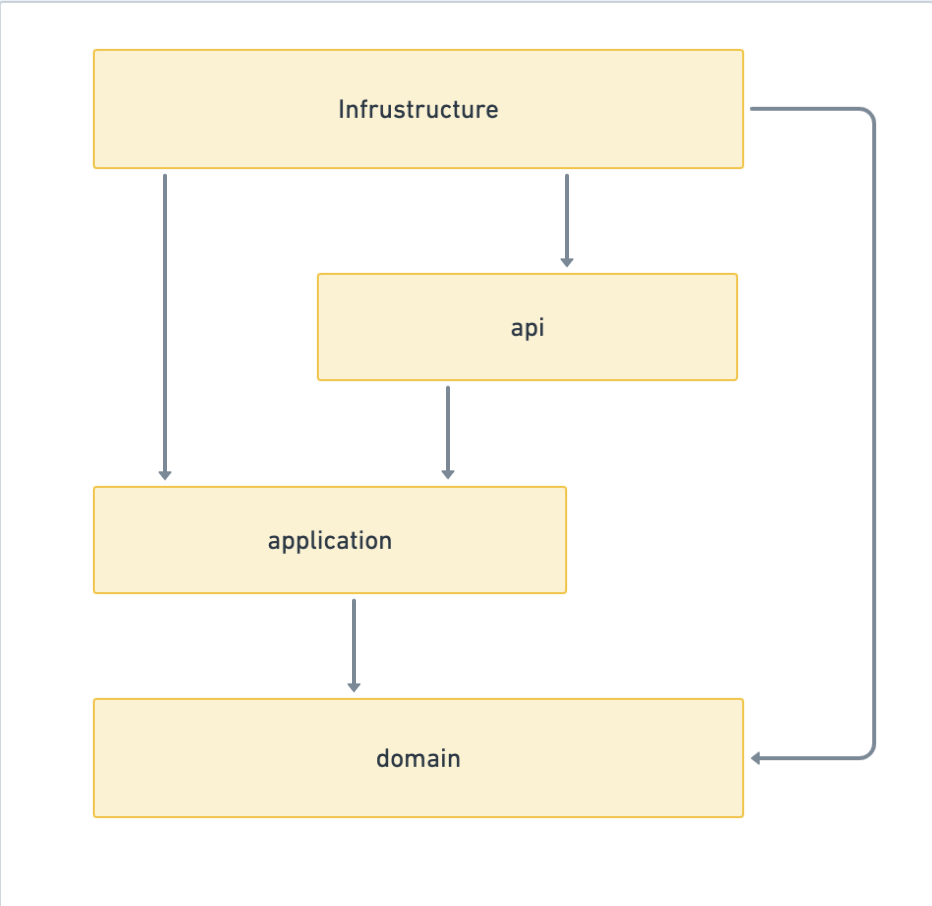

- [Problem Space](https://airwallex.atlassian.net/wiki/spaces/APA/pages/1464044048/DDD+Pattern#Problem-Space)
- [Solution Space](https://airwallex.atlassian.net/wiki/spaces/APA/pages/1464044048/DDD+Pattern#Solution-Space)
- [Project Space](https://airwallex.atlassian.net/wiki/spaces/APA/pages/1464044048/DDD+Pattern#Project-Space)
  - [Package Layer](https://airwallex.atlassian.net/wiki/spaces/APA/pages/1464044048/DDD+Pattern#Package-Layer)
  - [Mapping of layer and terminology](https://airwallex.atlassian.net/wiki/spaces/APA/pages/1464044048/DDD+Pattern#Mapping-of-layer-and-terminology)
- [Experience](https://airwallex.atlassian.net/wiki/spaces/APA/pages/1464044048/DDD+Pattern#Experience)
  - [Pros](https://airwallex.atlassian.net/wiki/spaces/APA/pages/1464044048/DDD+Pattern#Pros)
  - [Cons](https://airwallex.atlassian.net/wiki/spaces/APA/pages/1464044048/DDD+Pattern#Cons)
  - [Known Problems](https://airwallex.atlassian.net/wiki/spaces/APA/pages/1464044048/DDD+Pattern#Known-Problems)

# Problem Space

- Domain
- Sub Domain
  - core
  - support
  - generic

# Solution Space

- Bounded context: **boundaries of models. Mapping with subdomain is N:1.**
- Domain
  - Aggregate: An *Aggregate is a cluster of associated objects treated as a unit for data changes.* 
  - Aggregate root:  *External references are restricted to one member of the AGGREGATE*
  - Entity: *Object with* a unique identity 
  - Value object: *Object* without identity; they are defined solely by their attribute values
  - Factory: Factory to build aggregate.
  - Domain Event: An event represents something that took place in the domain
  - Domain service: business logic of the aggregate.
  - Repository: Repository of the aggregate root.
- Application
  - Command: Request changes to the domain by sending commands
  - Command Handler: Application Layer service handle one use case and drive the workflow of call different domain function or domain service function
  - Event Handler: Domain Event Handler

 

# Project Space

 

 

## Package Layer

- API(interfaces): This layer holds everything that interacts with other systems, such as RPC, Message-Queue, Restful API. It handles interpretation, validation, and translation of DTO to Command.
  - RPC: JsonRPC interfaces
  - Message: Message queue interfaces
  - Transform: DTO to Command transformer.
- Application: The application layer is responsible for driving the workflow of the application, matching the **use cases** at hand
  - command: per use case, request to change domain.  
  - command Handler: Drive the execution of command on the domain layer.
  - event handler: Domain event Handler
- Domain: The core of the business logic. There is one package per aggregate, and to each aggregate belongs entities, value objects, domain events, factories, domain services.
  - model: Domain model definition
  - service: domain services
  - factory: Factory to build aggregate
  - facade: ACL Layer for the domain. e.g. RPC call to the external system
  - repository: the interface of the domain repository. implementation is in the infrastructure layer
- Infrastructure: integration with external systems(**IOC**)
  - Persistence, Event, RPC, etc.
- Adaptor Layer: Translate input/output from external systems into the uniform and stable data format domain can understand.
  - Facade: translate input from different channels such as API, Message queue to the uniform Commands/Queries.
  - Adaptor: ACL Layer to the downstream systems. Translate Core Domain Model to external system data structures.
- Dependency: 

- DTO(interfaces) → Command → CommandHandler(application) → Domain → infrastructure

## Mapping of layer and terminology 

# **Experience**

## Pros

- Isolate the business problem with a tech solution
- Maintain core domain model and service in the domain layer and isolate with external services with adaptor pattern.
- Separate core business logic with side effects using domain events.
- Isolate different domain models and business logic by aggregate pattern.

## Cons

- The learning curve is a little bit high

## Known Problems

1. Transaction: the Aggregate root operation should be transactional
2. if the Repository and domain event publish within one transaction, the domain event handler may fail to read the aggregate root since the transaction has not committed yet.